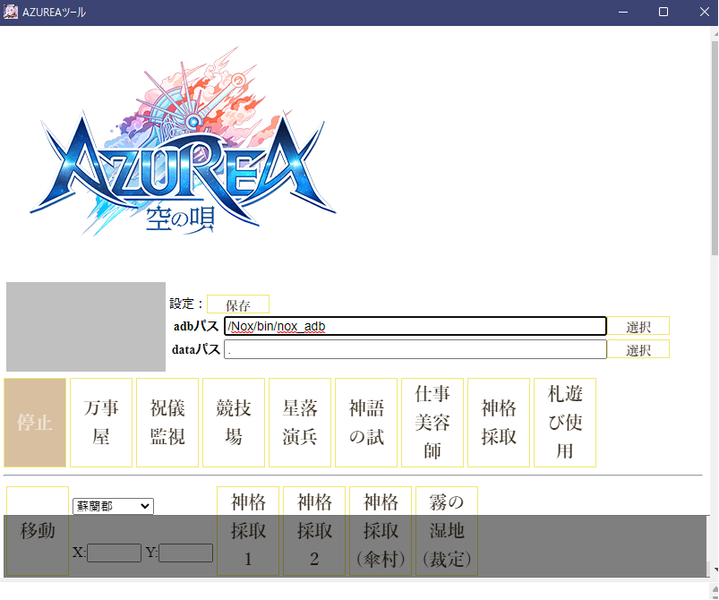

# AzureTool
スマートフォンアプリ「AZUREA」をちょっとだけ自動化するツール

OpenCVの練習の為に作ってみました。

## 概要

* 競技場の自動化  

* 星落演兵の半自動化
* 神語の試の半自動化

など

## 使用ライブラリ
* Visual C++ 再頒布可能パッケージ：
	 https://learn.microsoft.com/ja-JP/cpp/windows/latest-supported-vc-redist?view=msvc-170

	https://aka.ms/vs/17/release/vc_redist.x64.exe

## 環境

* Androidの環境	（NoxPlayer, NoxPlayerZで確認）
* 画面解像度	1280x720

## 使い方

### 実行

1. 必要なライブラリをインストールします。

1. 「Release」からダウンロードした「zip」ファイルを展開して中にある「AzureaTool.exe」を実行してください。

### 設定

1. adbのパスを指定
	Noxの場合：  
		Noxをインストールしたフォルダに「bin」がありその中に「nox_adb.exe」があるのでその場所を指定します。
1. dataのパス
	画像等を保存するパスを指定します。

### 競技場

1. 競技場に移動します。

1. その後、「競技場」ボタンをクリックで「停止」ボタンをクリックするまで繰り返し対戦を行います。

### 星落演兵

1. 「星落演兵」画面から「ソロ」または「デュオ」を選択します。

1. 後はマッチングするまで放置します。

1. １対戦が終わったら「停止」ボタンをクリックして終了させてください。

